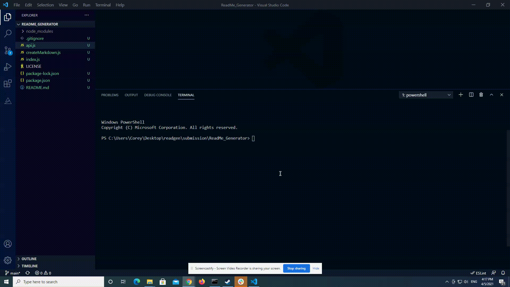

    # readme-generator 
    
    ## Description
        An app that creates a readme based on user input.
    
# Demo

    ## Table of Contents
        - [Installation](#installation)
        - [Usage](#usage)
        - [License](#license)
        - [Tests](#tests)
        - [Contributors](#contributors)

    ## Installation
    Packages required to run this program are: 
    github-api inquirer lodash markdown-utils
    
    ## Usage
    Examples of how to use this program: 
    To create a project readme file based on user input

    ## License
    MIT

    ## Tests
    To test, run the following command:
    no test for this

    ## Contributors
    just me

    ## Contact
    
 
    

    
View the project in GitHub at: https://github.com/cdcolbert/ReadMe_Generator.